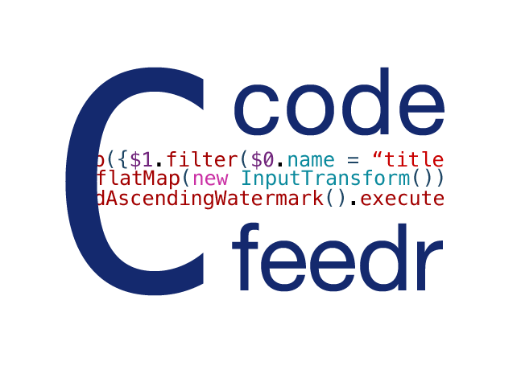

- - - -
This wiki provides documentation on the plugin infrastructure of the [CodeFeedr project](https://codefeedr.github.io/). Next to that, we provide information to create plugins yourself. 

## What is CodeFeedr
CodeFeedr is a infrastructure built on top of [Flink](https://flink.apache.org/) enabling to pipeline multiple Flink jobs using a message broker like [Kafka](https://kafka.apache.org/).
This allows you to easily setup a [DAG](https://en.wikipedia.org/wiki/Directed_acyclic_graph) of interconnected Flink jobs.

### Terminology

- Stage: A [Flink](https://flink.apache.org/) job. There are three types; InputStage, TransformStage and OutputStage.
- Buffer: A message broker in between stages to flow data from one stage to another. 
- Pipeline: A set of stages linked with buffers.
- PipelineBuilder: API interface to build a pipeline.
- Plugin: A set of stages in a certain context which can be used to build a pipeline. 