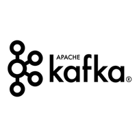

## What is CodeFeedr?

CodeFeedr is a software analytics infrastructure designed to simplify
setting up complex stream processing architectures.  It is built on top
of [Apache Flink](https://flink.apache.org/) and [Apache
Kafka](https://kafka.apache.org/) and has the following features:
- (Inter)connecting Apache Flink streaming jobs using Kafka as message
broker.
- Orchestration tools to run interconnected Flink setup.
- Distributed API key management.
- Plugin system to share re-usable streaming components.

## Documentation

### Structure
In order to get a grasp of the architecture of CodeFeedr have a look at
the [architecture](/mydoc_architecture.html) page. In general CodeFeedr
can be split into three parts:
- Core: All the implementations for stages, pipelines and utilities.
- Plugins: Set of plugins, which contain context related stages.
- Orchestration: Tools for running your pipeline on a cluster.

You can contribute to CodeFeedr by either improving and extending the
core and already existing plugins or by writing your own plugin.

### Terminology
In this section some terminology from the CodeFeedr framework will be
discussed:

- Stage: A [Flink](https://flink.apache.org/) job. There are three
types; InputStage, TransformStage and OutputStage.
- Buffer: A message broker in between stages to flow data from one stage
to another (like Apache Kafka).  
- Pipeline: A set of stages linked with buffers.
- PipelineBuilder: API interface to build a pipeline.
- Plugin: A set of stages in a certain context which can be used to
build a pipeline.

### Contributors
CodeFeedr is currently maintained and improved by:
- [Wouter
Zorgdrager](https://www.linkedin.com/in/wouter-zorgdrager-a4746512a/)

Former contributors:
- [Jos Kuijpers](https://nl.linkedin.com/in/jos-kuijpers-4b714032)
- [Joris Quist](https://www.linkedin.com/in/joris-quist-a44245170)


